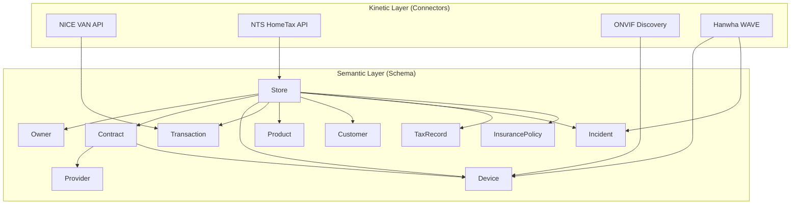
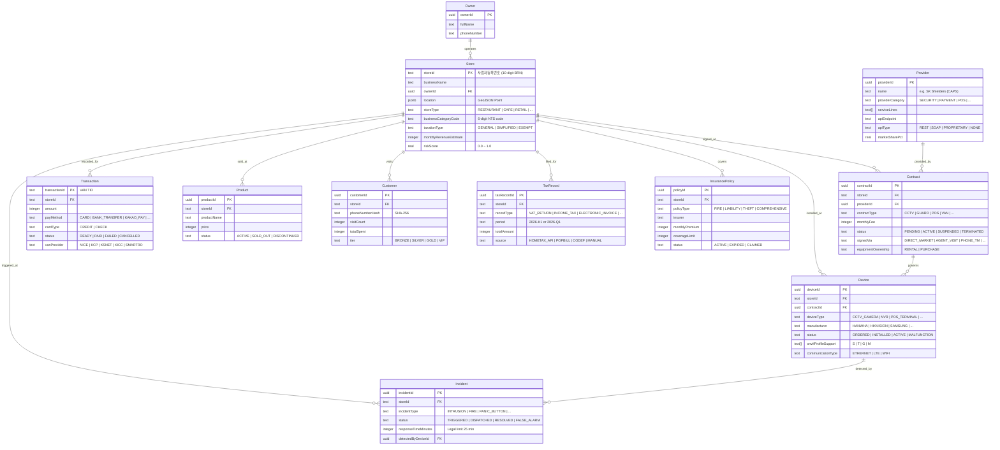

# Store Ontology

**Open-source unified schema for Korean SMB store data**

[](./LICENSE)
[](https://www.typescriptlang.org/)
[](./)

---

## What is Store Ontology?

Store Ontology is a Palantir Foundry-inspired 3-layer ontology for Korean small business (SMB) stores.

### The Problem

Store data in Korea is fragmented across dozens of siloed systems:

- **VAN companies** (NICE, KCP, KSNET) hold payment transaction data
- **Security providers** (SK Shielders/CAPS, S1, KT Telecop) hold CCTV and dispatch data
- **POS systems** (PayHere, Toss, Samsung) hold product and customer data
- **Tax authorities** (NTS HomeTax, PopBill, CODEF) hold tax filing records
- **Insurance companies** hold policy and claims data

No single system sees the whole store. A store owner managing a cafe has their payment data in one VAN, their security contract in another company, their tax records in HomeTax, and their insurance policy somewhere else entirely.

### The Solution

Store Ontology provides a unified schema that connects all these data sources into one coherent model:

**Store = 1 Object. Everything else links to it.**

The architecture follows Palantir Foundry's ontology pattern with three layers:

1. **Semantic Layer** -- 11 Object Types (Drizzle PostgreSQL tables) defining what the data means
2. **Kinetic Layer** -- Connectors that fetch and map data from external APIs into the ontology
3. **Palantir Compatibility** -- naming conventions and helpers that make the ontology pluggable into Palantir Foundry

---

## Architecture



---

## Entity Relationship Diagram



---

## Quick Start

### Installation

```bash
pnpm add @store-ontology/schema @store-ontology/core
```

### Basic Usage

```typescript
import { stores, contracts, devices, transactions } from "@store-ontology/schema";
import { StoreType, ContractType, DeviceType, PayMethod } from "@store-ontology/core";

// All 11 Object Types are available as Drizzle tables
import {
  owners,
  stores,
  providers,
  contracts,
  devices,
  transactions,
  products,
  customers,
  incidents,
  taxRecords,
  insurancePolicies,
} from "@store-ontology/schema";

// Enums are Zod schemas -- use them for runtime validation
const storeType = StoreType.parse("RESTAURANT"); // OK
const badType = StoreType.safeParse("INVALID");   // { success: false, ... }
```

### Validate a Business Registration Number

```typescript
import { validateBusinessNumber, formatBusinessNumber } from "@store-ontology/validators";

const result = validateBusinessNumber("1234567890");
// { valid: true, taxOfficeCode: "123", businessType: "INDIVIDUAL_TAXABLE" }

const formatted = formatBusinessNumber("1234567890");
// "123-45-67890"
```

---

## Packages

| Package | Description | Status |
|---------|-------------|--------|
| `@store-ontology/core` | Enums, Connector interface, Palantir helpers | Available |
| `@store-ontology/schema` | 11 Drizzle tables + relations | Available |
| `@store-ontology/validators` | Business number validation + NTS API | Available |
| `@store-ontology/connector-nice` | NICE VAN --> Transaction | Available |
| `@store-ontology/connector-nts` | NTS HomeTax --> Store enrichment | Available |
| `@store-ontology/connector-onvif` | ONVIF Discovery --> Device | Available |
| `@store-ontology/connector-wave` | Hanwha WAVE --> Device/Incident | Available |

---

## Connector Pattern

Every external data source integration implements the `Connector<TRaw, TEntity>` interface from `@store-ontology/core`:

```typescript
interface Connector<TRaw, TEntity> {
  readonly config: ConnectorConfig;

  /** Transform raw API/protocol response to ontology entity */
  map(raw: TRaw): TEntity;

  /** Fetch from source system and return mapped entity */
  fetch(params: Record<string, unknown>): Promise<ConnectorResult<TEntity | TEntity[]>>;

  /** Validate the mapped entity against its Zod schema */
  validate(entity: TEntity): boolean;
}
```

### Implementing a Custom Connector

```typescript
import type { Connector, ConnectorConfig, ConnectorResult } from "@store-ontology/core";

interface MyRawData {
  // fields from the external API
}

interface MyEntity {
  // fields matching the ontology schema
}

class MyConnector implements Connector<MyRawData, MyEntity> {
  readonly config: ConnectorConfig = {
    name: "My Custom Connector",
    version: "0.1.0",
    sourceSystem: "my-source",
  };

  map(raw: MyRawData): MyEntity {
    // Transform raw API data to ontology entity
    return { /* ... */ };
  }

  async fetch(params: Record<string, unknown>): Promise<ConnectorResult<MyEntity>> {
    const fetchedAt = new Date().toISOString();
    // Call your external API, then map
    const raw = await callExternalApi(params);
    const entity = this.map(raw);
    return {
      success: true,
      data: entity,
      metadata: { sourceSystem: this.config.sourceSystem, fetchedAt },
    };
  }

  validate(entity: MyEntity): boolean {
    // Validate against a Zod schema
    return true;
  }
}
```

---

## Palantir Compatibility

Store Ontology naming conventions follow Palantir Foundry's official rules so the schema can be imported directly into a Foundry environment:

| Convention | Format | Example |
|------------|--------|---------|
| Object Type API Name | PascalCase | `Store`, `InsurancePolicy` |
| Object Type ID | kebab-case | `store`, `insurance-policy` |
| Property API Name | camelCase | `storeId`, `monthlyFee` |
| Link Type | snake_case verb | `operates`, `installed_at` |

Helper functions are provided in `@store-ontology/core`:

```typescript
import { toObjectTypeId, toPropertyApiName, toLinkTypeId } from "@store-ontology/core";

toObjectTypeId("InsurancePolicy");   // "insurance-policy"
toPropertyApiName("store_id");       // "storeId"
toLinkTypeId("installedAt");         // "installed_at"
```

The `Store` Object Type also implements the Palantir `Facility` interface for cross-vertical analytics compatibility.

---

## Development

```bash
# Clone and install
git clone https://github.com/your-org/store-ontology.git
cd store-ontology
pnpm install

# Type check all packages
pnpm run typecheck

# Run tests
pnpm test

# Build all packages
pnpm build
```

---

## License

[MIT](./LICENSE) -- Copyright (c) 2026 Balerion Inc.
